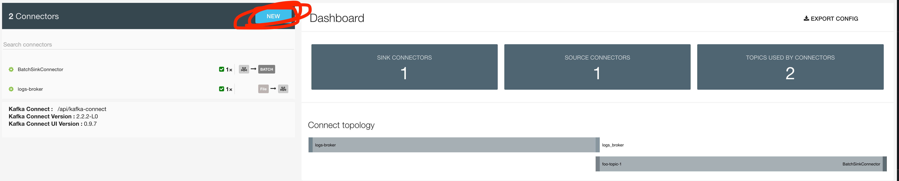
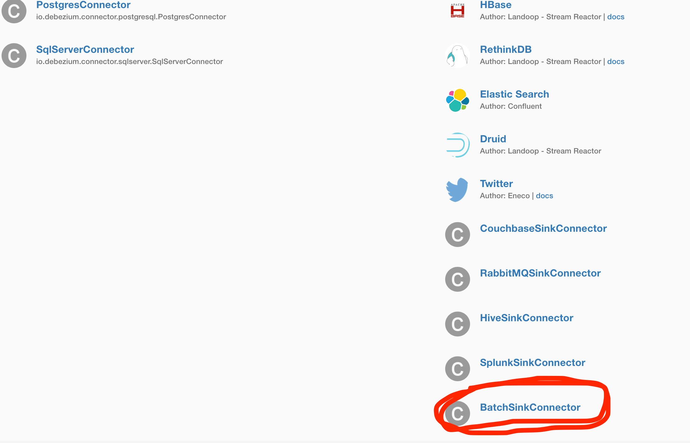
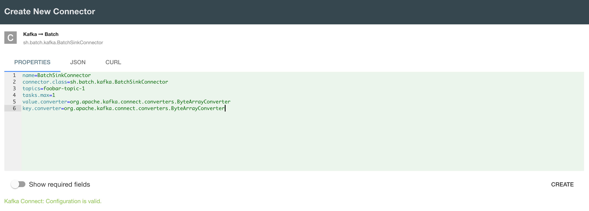

# batch.sh kafka sink connector

This [kafka sink connector](https://docs.confluent.io/current/connect/devguide.html#sink-tasks) funnels records sent over specified topics to the batch.sh collector service.

## Setup

### Environment

* Requires **Java 8**

Bootstrap all you need to get going

`make setup`

Build the artifact

`make`

Unit test the artifact with mocked kafka and destination

`make test`

## Running Locally

The easiest way to run the connector locally is with [docker-compose](https://docs.docker.com/compose/).

The compose file is configured to start up a container with all the needed services to test the connector
along with a comprehensive dashboard UI located at http://localhost:3030. The connector is added via a volume mount
to `/collectors` which is included in the `pluginPath` for kafka on the container host.

In order to run the service, execute:

```shell
$ docker-compose up
```

### Configure the connector

The connector itself is simply a set of JAR files containing instructions on how
to pull records off of topics and what to do with them plus any dependencies
needed to perform these tasks. Kafka is able to discover connector plugins
on start as long as the JARs are in a directory within the configured `pluginPath`.

Our docker-compose file should automatically add the built JAR from our `target` dir
into the `pluginPath` of our container so it should be detected on startup.

Once it is detected it must be configured. On base Kafka we would do this through a
request to the Kafka-Connect REST interface. Since our dev container ships with a UI
we can configure it that way:

1. Navigate to the UI which by default should be running on http://localhost:3030
2. Click 'Enter' under the Kafka Connect UI box
3. Setup a New connector

4. Choose 'BatchSinkConnector' from the list of options

5. Provide necessary configuration

6. Create and allow it to rebalance tasks

The connector can be viewed from the Connector UI and from there it is possible to see if the
task launched successfully or if it hit some error on initialization. 


